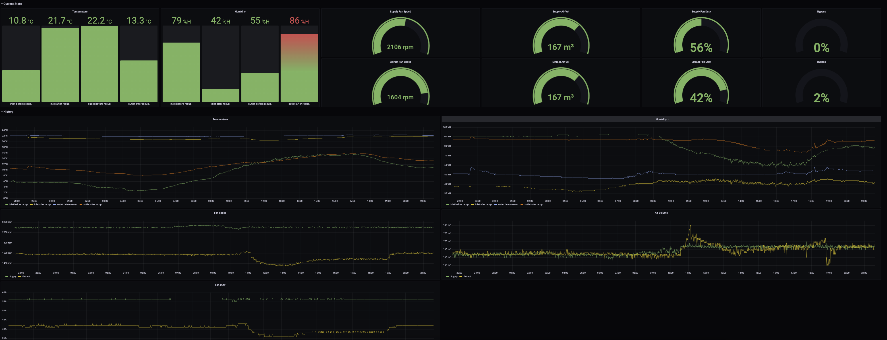

# air-exporter

Prometheus exporter for Zehnder ComfoAir Q ventilation units.

Requires an USB CAN device that has a SocketCAN driver (for example a candleLight compatible device). After connecting the CAN adapter to the ventilation unit run `sudo ./air-exporter setup` to configure the CAN network device. Run `./air-exporter` to start up the promtheus exporter. 

## Credits
The Exporter is based on the reverse engineering work done by the project [zcan](https://github.com/marco-hoyer/zcan)

